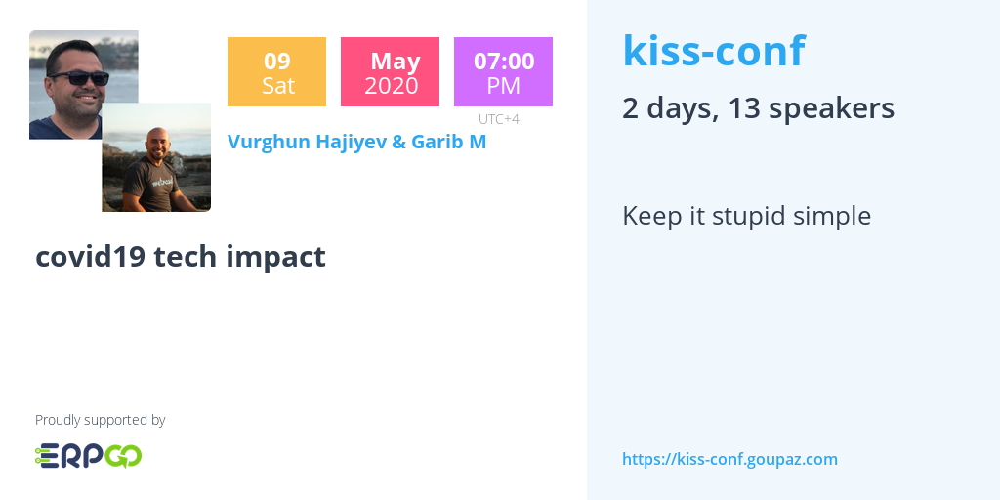
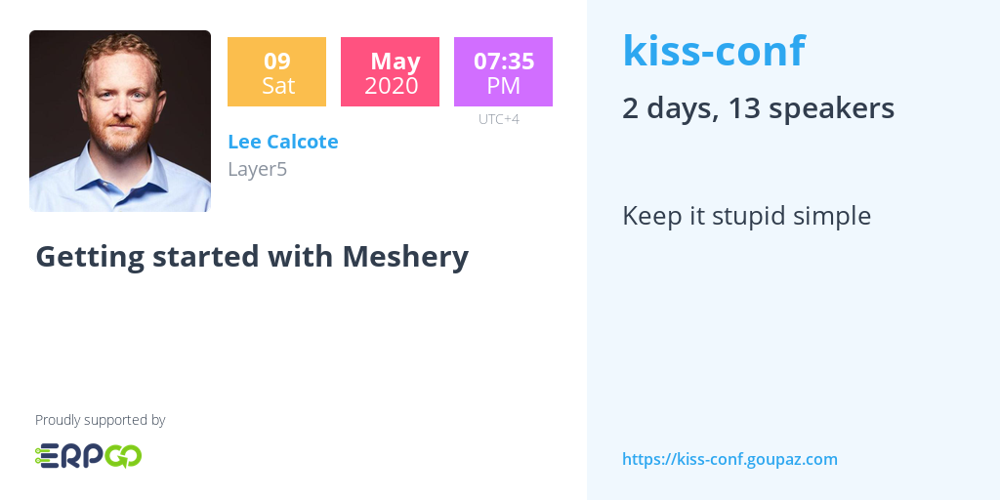
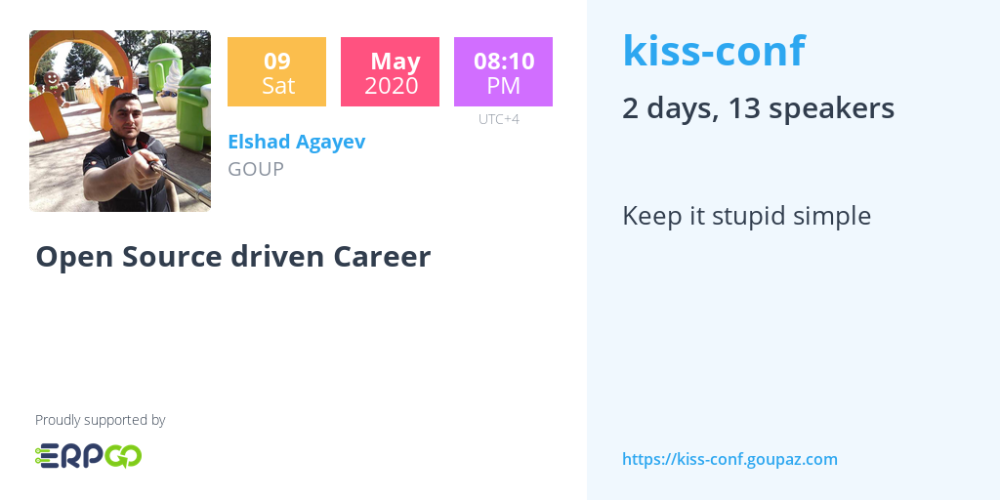
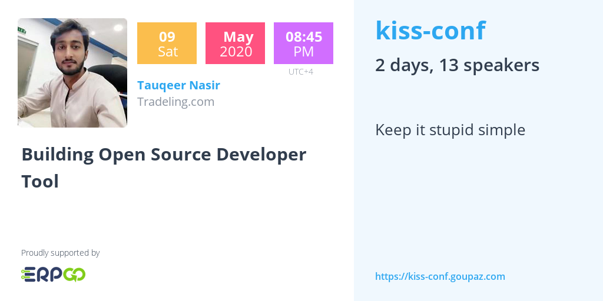
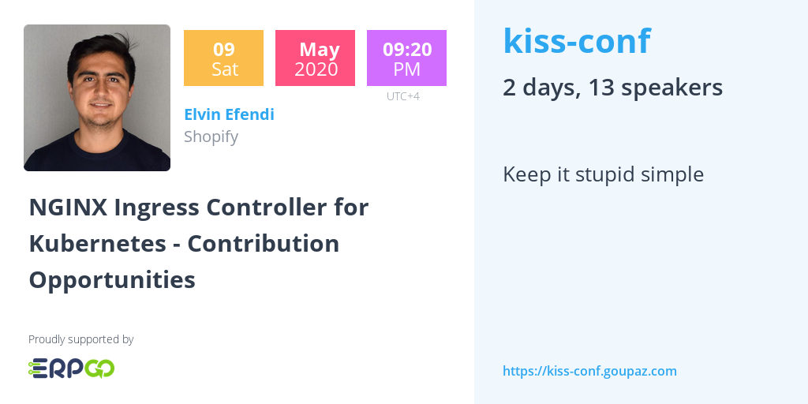
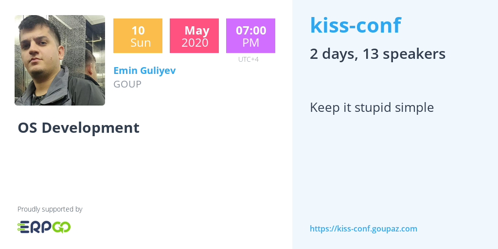
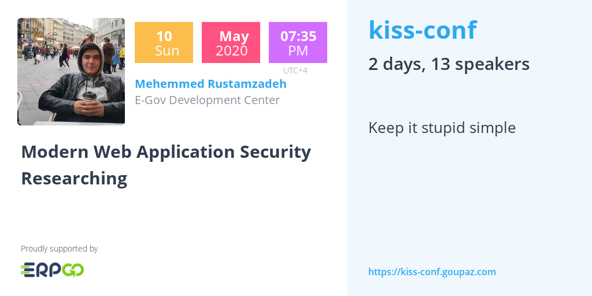
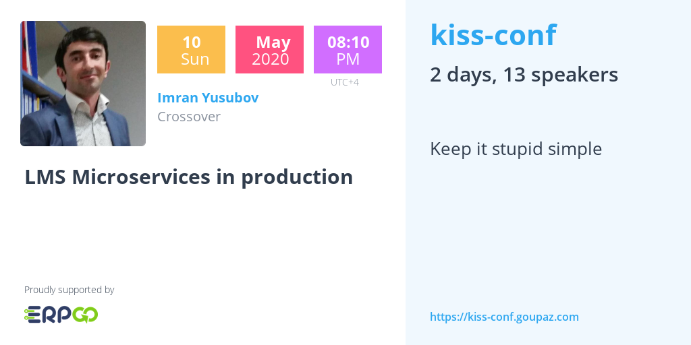
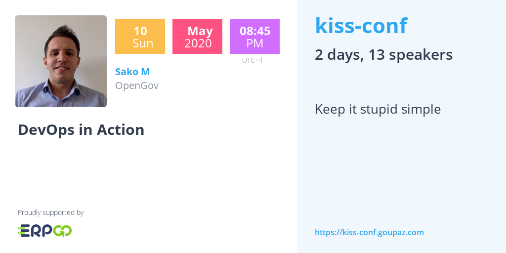
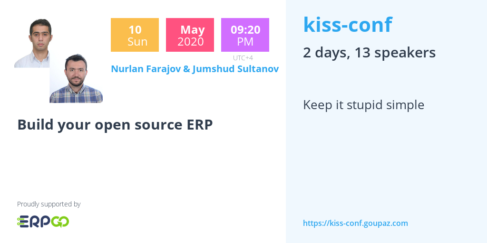

# kiss.conf 2020
###### keep it stupid simple

###### 09-10 May, 18:45-22:00 (GMT+4)

13 speakers from 6 categories two day event!

## Speakers and topics

## Hosted by

## Support by

## About Us

### Who we are?
The GOUP project is the idea of a Azeri tech community living abroad.

### Mission
Build bridges between tech professionals in a collaborative ways across the borders.

### Vision
Make the world better place to live, using technology and right culture.

### Objectives
Build egoless, collaborative, competent,  decentralized, scalable, fun community culture.
Our goal is simple to structure and index the data flow within communities. 

## Contact
You can join us:

[Slack](https://bit.ly/2wSJ5db)

[Youtube](https://www.youtube.com/goupaz)

[Facebook](https://www.facebook.com/goupaz)
