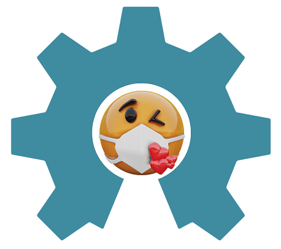
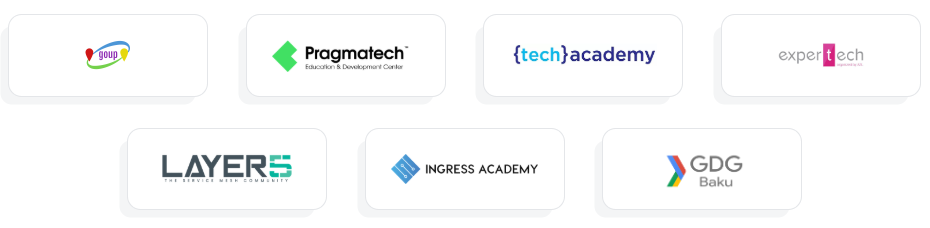

  

# [kiss.conf - keep it stupid simple](https://kiss-conf.goupaz.com/)
- [About Us](#aboutus)
- [Contact](#contact)
- [Host conference](howto/hostconference.md)

## kiss.conf 2020

Time: 09-10 May, 18:45-22:00 (GMT+4)

Line: Open Source

Language: English

##### DAY 01

|No| Topic | PPT| Video |Date|Mentor|
|------|----------------------|---------|---|-----|-----|
|-1|Promo Video|N/A|[Session-1](https://www.youtube.com/watch?v=h2S6tt1GnWM)|08 MAY 2020|[Sako M](https://www.linkedin.com/in/sakom/)|
|0|Opening Ceremony|N/A|[Session0](https://www.youtube.com/watch?v=zik-QPs64n0)|09 MAY 2020, 18:45|[Sako M](https://www.linkedin.com/in/sakom/)|
|1|covid19 tech impact|N/A|[Session01](https://www.youtube.com/watch?v=Qdgitknf18U)|09 MAY 2020, 19:00|[Vurgun Hajiyev](https://www.linkedin.com/in/vurgun/)  [Garib M](https://www.linkedin.com/in/garibmehdiyev/)|
|2|Getting started with Meshery|N/A|[Session02](https://www.youtube.com/watch?v=qHjblquPuio)|09 MAY 2020, 19:35|[Lee Calcote](https://www.linkedin.com/in/leecalcote/)|
|3|Open Source driven Career|N/A|[Session03](https://www.youtube.com/watch?v=WnW6tc4EeKw)|09 MAY 2020,20:10|[Elshad Agayev](https://www.linkedin.com/in/elshadaghazadeh/)|
|4|Building Open Source Developer Tool|N/A|[Session04](https://www.youtube.com/watch?v=zGpZEmOGziI)|09 MAY 2020, 20:45|[Tauqeer Nasir](https://www.linkedin.com/in/tauqeer-nasir-767624111/)|
|5|NGINX Ingress Controller for Kubernetes|N/A|[Session05](https://www.youtube.com/watch?v=fxm6zwyycvA)|10 MAY 2020, 21:20|[Elvin Efendi](https://www.linkedin.com/in/elvinefendi/)|

##### DAY 02

|No| Topic | PPT| Video |Date|Mentor|
|------|----------------------|---------|---|-----|-----|
|1|OS Development|N/A|[Session01]()|10 MAY 2020, 19:00|[Emin Guliyev](https://www.linkedin.com/in/emin-ghuliev-461a22129/)|
|2|Modern Web Application Security|N/A|[Session02]()|10 MAY 202, 19:35|[Mehemmed Rustamzadeh]()|
|3|LMS Microservices in production|N/A|[Session03]()|10 MAY 2020, 20:45|[Imran Yusubov](https://www.linkedin.com/in/imran-yusubov-9334744a/)|
|4|DevOps in Action|N/A|[Session4]()|10 MAY 2020, 20:10|[Sako M](https://www.linkedin.com/in/sakom/)|
|5|Build your open source ERP|N/A|[Session05]()|10 MAY 2020, 21:20|[Jumshud Sultanov](https://www.linkedin.com/in/jumshudsultan/)  [Nurlan Farajov](https://www.linkedin.com/in/nurlan-farajov/)|
|0|Closing Ceremony|N/A|[Session0]()|09 MAY 2020, 22:00|[Nabi N](https://www.linkedin.com/in/nabi-nabizade/)|

## Hosted by

## About Us

### Who we are?
The GOUP project is the idea of a Azeri tech community living abroad.

### Mission
Build bridges between tech professionals in a collaborative ways across the borders.

### Vision
Make the world better place to live, using technology and right culture.

### Objectives
Build egoless, collaborative, competent,  decentralized, scalable, fun community culture.
Our goal is simple to structure and index the data flow within communities. 

## Contact
You can join us:

[Slack](https://bit.ly/2wSJ5db)

[Youtube](https://www.youtube.com/goupaz)

[Facebook](https://www.facebook.com/goupaz)
